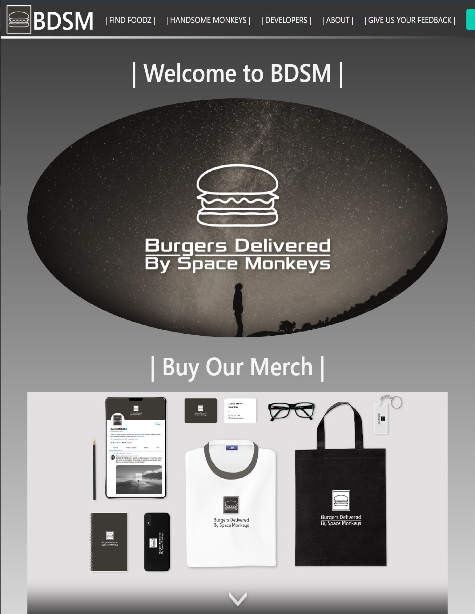

# B `urgers` 
# D `elivered by`
# S `pace` 
# M `onkeys`

# Burgers Delivered by Space Monkeys (BDSM)

Welcome to "Burgers Delivered by Space Monkeys" (BDSM)! This is a whimsical and interactive web application that allows users to order delicious burgers delivered by our adorable space monkey couriers.

## SCREENSHOT

## TABLE OF CONTENTS

* [Features](#features)

* [Technologies used](#technologiesused)

* [Getting started](#gettingstarted)

* [Folder structure](#folder-structure)

* [Contributing](#contributing)

* [License](#license)

* [Development team](#dev-team)

* [Repository location](#repo-location)

* [Questions](#questions)

## [Features](#features)

- Browse through a variety of space-themed burger restaurants and their menus.
- Choose your burger with your favorite toppings and add-ons.
- Place orders and track them in real-time with our fun and interactive order tracking system.
- Rate and review your burgers to provide valuable feedback.
- Enjoy a secure user authentication system for account registration and login.
- Explore your order history and manage your profile preferences.

## [Technologies used](#technologiesused)

- Node.js
- Express.js
- Handlebars.js
- MySQL
- Sequelize ORM
- Express-session and Cookies for authentication
- Heroku for deployment

## [Getting started](#gettingstarted)

To get started with the project, follow these steps:

1. Clone the repository: `git clone <repository-url>`
2. Install the dependencies: `npm install`
3. Set up the database: Create a MySQL database and configure the connection in `config/config.json`.
4. Set up environment variables: Update the environment variables in a `.env` file or configure them directly in your hosting environment.
5. Run the application: `npm start`
6. Open your web browser and navigate to `http://localhost:3000` to access the application.

## [Folder structure](#folder-structure)

The project follows the MVC (Model-View-Controller) paradigm for organizing the codebase. Here's an overview of the folder structure:

- `config`: Contains configuration files for the database and connection setup.
- `controllers`: Includes controller files responsible for handling different aspects of the application logic.
- `models`: Contains model files representing the database schema for various entities.
- `public`: Includes static assets such as CSS and JavaScript files.
- `routes`: Contains route files defining the API endpoints and their corresponding controllers.
- `views`: Contains the Handlebars.js templates for rendering the HTML pages and components.
- `server.js`: The main entry point of the application.
- `package.json`: Includes project dependencies and scripts.

## [Contributing](#contributing)

Contributions to the "Burgers Delivered by Space Monkeys" project are welcome! If you find any bugs or have suggestions for improvements, please open an issue or submit a pull request.

## [License](#license)

This project is licensed under the [MIT License](https://opensource.org/licenses/MIT).

## [Development team](#dev-team)

- [Dustin Ildefonso](https://github.com/dustinii/)
- [Samuel Carag](https://github.com/sammyrey6)
- [Brian Autieri](https://github.com/Brian-Autieri)
- [Joceliyn Valdez](https://github.com/jovaldez98)
- [Paul Koehler](https://github.com/pk50sshowa)

## [Repository location](#repo-location)
https://github.com/dustinii/BDSM

## [Questions](#questions)
Please contact one of the developers if you have questions about this project!